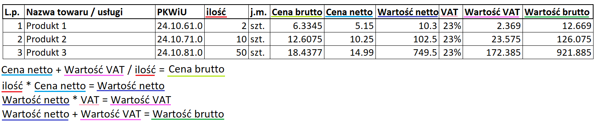

# Module headers_classifier
That module is responsible for counting the probability of the columns type. 
# Legend
* **ordinal_number** -> number of the row [**pl** L.p.]
* **name** -> name of the product, can be represented as "name" or "service" [**pl** Nazwa towaru / usługi]
* **pkwiu** -> Polish Classification of Goods and Services [**pl** PKWiU]
* **quantity** -> products amount, can also be represented as "consumption" [**pl** ilość]
* **unit_of_measure** -> [**pl** j.m.]
* **gross_price** -> gross price for one product -> vat_value / quantity + net_value = gross_value [**pl** Cena brutto]
* **net_price** -> net price of one product [**pl** Cena netto]
* **net_value** -> net price of all products - quantity * net_price = net_value [**pl** Wartość netto]
* **vat** -> VAT percentage value [**pl** VAT]
* **vat_value** -> VAT amount from the whole price - net_value * vat = vat_value [**pl** Wartość VAT]
* **gross_value** -> overall gross price - net_value + vat_value = gross_value [**pl** Wartość brutto]

Example in polish:
